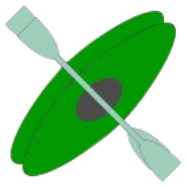

# CANU
### 현대 오토에버 모빌리티 임베디드 SW 스쿨 1기 CANoe 프로젝트  
- 팀장: 이시윤  
- 조원: 강민우, 김민규, 박윤서, 전지은, 한수진
  
### 프로젝트 주제
터널 주행 중 내기모드 자동전환 기능 구현  
### 프로젝트 기간
2023년 12월 04일 ~ 2023년 12월 11일  

## 목차
- [Development Tools](#development-tools)
- [CAN DB](#can-db)
  - [CAN DB Overview](#can-db-overview)
  - [CAN DB Channel](#can-db-channel)
- [Panel](#panel)
  - [Panel Image](#panel-image)
  - [Panel Information](#panel-information)

## Development Tools
|    Tool name  |                       Image                        |   |     Tool name    |                        Image                       |
|:-------------:|:--------------------------------------------------:|---|:----------------:|:--------------------------------------------------:|
|Vector CANoe 15||   |Vector CANdb++ 3.1||

## CAN DB
### CAN DB Overview
    

### CAN DB Channel
|                     **Ch 1**                         |                         **Ch 2**                      |
|:----------------------------------------------------:|:-----------------------------------------------------:|
|| |
   

## Panel
- ### Panel Image
    

- ### Panel Information
  - #### Panel Info 1
      
  - #### Panel Info 2
      
  - #### Panel Info 3
      
  - #### Panel Info 4
      

